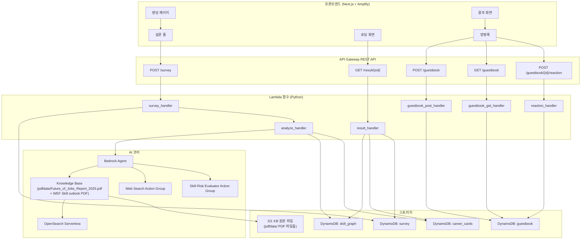

# Design Document: Career Doomsday Clock

## Overview

Career Doomsday Clock은 AI 디스토피아 세계관 기반의 인터랙티브 커리어 분석 웹 서비스이다. 사용자는 폐허 도시 배경의 랜딩 페이지에서 시작하여, 설문을 통해 직업 정보를 입력하고, Amazon Bedrock Agent가 분석한 직업 수명(D-Day)과 새로운 커리어 카드를 확인한 뒤, 방명록에 흔적을 남기고 탈출한다.

기술 스택:
- **프론트엔드**: Next.js (App Router) + TypeScript, AWS Amplify 호스팅
- **백엔드**: API Gateway REST API + Lambda (Python 3.12)
- **AI**: Amazon Bedrock (Claude 3.5 Sonnet) + Knowledge Base (OpenSearch Serverless, 소스: `pdfdata/Future_of_Jobs_Report_2025.pdf`, `pdfdata/WEF_Future_of_Jobs_Report_2025(Skill outlook).pdf`) + Agent
- **스토리지**: DynamoDB (4개 테이블), S3 (`pdfdata/` 폴더 PDF 파일들 저장)
- **인프라**: AWS CDK (TypeScript)

## Architecture



## Components and Interfaces

### 프론트엔드 컴포넌트

| 컴포넌트 | 경로 | 설명 |
|---------|------|------|
| `LandingPage` | `/` | 폐허 도시 배경, "문을 열고 들어가기" 버튼, 세션 ID 생성 |
| `SurveyForm` | `/survey` | 디스토피아 어조 설문, 단일 화면에 이름/직업/장점/취미 4개 입력 필드, 유효성 검증 |
| `LoadingScreen` | `/loading` | 세계관 로딩 메시지, 폴링으로 분석 완료 확인 |
| `ResultPage` | `/result` | 2단계 결과 화면 (디스토피아 선고 → 유토피아 탈출) |
| `DoomsdayCounter` | 결과 내 | D-Day 카운트업 애니메이션 + 네온 글로우 |
| `SkillRiskCard` | 결과 내 | 스킬별 위험도 카드 (확률%, 시간, 근거) |
| `CareerCard` | 결과 내 | 커리어 조합 카드 (공식, 사유, 로드맵) |
| `Guestbook` | `/guestbook` | 방명록 목록, 등록 폼, 이모지 반응 |

### API 인터페이스

#### POST /survey
- **Request Body**:
```json
{
  "session_id": "uuid-v4",
  "name": "string",
  "job_title": "string",
  "strengths": "string",
  "hobbies": "string"
}
```
- **Response**: `{ "session_id": "uuid-v4", "status": "analyzing" }`

#### GET /result/{sid}
- **Response (200)**:
```json
{
  "session_id": "uuid-v4",
  "status": "completed",
  "dday": 5,
  "skill_risks": [
    {
      "skill_name": "string",
      "replacement_prob": 75,
      "time_horizon": 3,
      "justification": "string"
    }
  ],
  "career_cards": [
    {
      "card_index": 0,
      "combo_formula": "[현재직업] + [장점] + [취미] = [새 직업명]",
      "reason": "string",
      "roadmap": [
        { "step": "string", "duration": "string" }
      ]
    }
  ]
}
```
- **Response (202)**: `{ "status": "analyzing" }`
- **Response (404)**: `{ "error": "Session not found" }`

#### POST /guestbook
- **Request Body**:
```json
{
  "session_id": "uuid-v4",
  "job_title": "string",
  "dday": 5,
  "message": "string"
}
```
- **Response**: `{ "entry_id": "uuid-v4", "created_at": "ISO-8601" }`

#### GET /guestbook
- **Query Params**: `?limit=20&last_key=base64-encoded`
- **Response**:
```json
{
  "items": [
    {
      "entry_id": "uuid-v4",
      "created_at": "ISO-8601",
      "job_title": "string",
      "dday": 5,
      "message": "string",
      "reactions": { "😱": 3, "💪": 5 }
    }
  ],
  "last_key": "base64-encoded-or-null"
}
```

#### POST /guestbook/{id}/reaction
- **Request Body**: `{ "emoji": "😱" }`
- **Response**: `{ "reactions": { "😱": 4, "💪": 5 } }`

### Lambda 함수

| 함수명 | 런타임 | 역할 |
|--------|--------|------|
| `survey_handler` | Python 3.12 | 설문 저장 + 분석 트리거 (비동기 invoke) |
| `analyze_handler` | Python 3.12 | Bedrock Agent 호출, 결과 저장 (timeout: 120s) |
| `result_handler` | Python 3.12 | 세션별 결과 조회 |
| `guestbook_post_handler` | Python 3.12 | 방명록 등록 |
| `guestbook_get_handler` | Python 3.12 | 방명록 목록 조회 (페이지네이션) |
| `reaction_handler` | Python 3.12 | 이모지 반응 추가 (DynamoDB ADD) |

## Data Models

### DynamoDB 테이블 스키마

#### survey 테이블
| 속성 | 타입 | 키 | 설명 |
|------|------|-----|------|
| session_id | String | PK | UUID v4 세션 식별자 |
| name | String | - | 사용자 이름 |
| job_title | String | - | 현재 직업 |
| strengths | String | - | 장점 |
| hobbies | String | - | 취미 |
| status | String | - | analyzing / completed / error |
| created_at | String | - | ISO-8601 생성 시각 |

#### skill_graph 테이블
| 속성 | 타입 | 키 | 설명 |
|------|------|-----|------|
| session_id | String | PK | 세션 식별자 |
| skill_name | String | SK | 스킬명 |
| category | String | - | 스킬 카테고리 |
| replacement_prob | Number | - | AI 대체 확률 (0-100) |
| time_horizon | Number | - | 대체 시간 범위 (년) |
| justification | String | - | 근거 텍스트 |

#### career_cards 테이블
| 속성 | 타입 | 키 | 설명 |
|------|------|-----|------|
| session_id | String | PK | 세션 식별자 |
| card_index | Number | SK | 카드 순서 (0, 1, 2) |
| combo_formula | String | - | 조합 공식 |
| reason | String | - | 추천 사유 |
| roadmap | List<Map> | - | 전환 로드맵 [{step, duration}] |

#### guestbook 테이블
| 속성 | 타입 | 키 | 설명 |
|------|------|-----|------|
| entry_id | String | PK | UUID v4 항목 식별자 |
| created_at | String | SK | ISO-8601 생성 시각 |
| session_id | String | - | 세션 식별자 |
| job_title | String | - | 직업명 |
| dday | Number | - | D-Day 값 |
| message | String | - | 한마디 메시지 |
| reactions | Map | - | 이모지별 카운트 {"😱": 3} |

- **GSI**: `created_at-index` (PK: 고정 파티션 키 "ALL", SK: created_at) — 최신순 조회용

### Python 데이터 모델 (Pydantic)

```python
from pydantic import BaseModel, Field
from typing import List, Dict, Optional

class SurveyRequest(BaseModel):
    session_id: str
    name: str = Field(min_length=1)
    job_title: str = Field(min_length=1)
    strengths: str = Field(min_length=1)
    hobbies: str = Field(min_length=1)

class SkillRisk(BaseModel):
    skill_name: str
    category: str
    replacement_prob: int = Field(ge=0, le=100)
    time_horizon: float = Field(gt=0)
    justification: str

class RoadmapStep(BaseModel):
    step: str
    duration: str

class CareerCard(BaseModel):
    card_index: int = Field(ge=0, le=2)
    combo_formula: str
    reason: str
    roadmap: List[RoadmapStep]

class AnalysisResult(BaseModel):
    session_id: str
    dday: float
    skill_risks: List[SkillRisk]
    career_cards: List[CareerCard]

class GuestbookEntry(BaseModel):
    entry_id: str
    created_at: str
    session_id: str
    job_title: str
    dday: float
    message: str
    reactions: Dict[str, int] = Field(default_factory=dict)

class GuestbookRequest(BaseModel):
    session_id: str
    job_title: str
    dday: float
    message: str = Field(min_length=1)

class ReactionRequest(BaseModel):
    emoji: str = Field(min_length=1, max_length=2)
```


## Correctness Properties

*A property is a characteristic or behavior that should hold true across all valid executions of a system-essentially, a formal statement about what the system should do. 
Properties serve as the bridge between human-readable specifications and machine-verifiable correctness guarantees.*

### Property 1: 세션 ID UUID v4 형식 준수

*For any* 생성된 세션 ID, 해당 값은 UUID v4 형식(8-4-4-4-12 hex, version 4)을 따라야 한다.

**Validates: Requirements 1.4**

### Property 2: 설문 유효성 검증 — 필수 항목 존재 시 통과

*For any* 설문 데이터에서 모든 필수 항목(name, job_title, strengths, hobbies)이 비어있지 않은 값으로 채워져 있으면, 유효성 검증은 통과해야 한다.

**Validates: Requirements 2.2**

### Property 3: 설문 유효성 검증 — 필수 항목 누락 시 실패

*For any* 설문 데이터에서 하나 이상의 필수 항목이 누락되거나 빈 값이면, 유효성 검증은 실패하고 누락된 필드 목록을 반환해야 한다.

**Validates: Requirements 2.2, 2.3**

### Property 4: 데이터 모델 JSON 직렬화 라운드트립

*For any* 유효한 SurveyRequest, AnalysisResult, 또는 GuestbookEntry 객체, JSON으로 직렬화한 후 역직렬화하면 원본 객체와 동일한 값을 가져야 한다.

**Validates: Requirements 3.5, 3.6, 8.5**

### Property 5: 스킬 위험도 카드 렌더링 완전성

*For any* SkillRisk 데이터, 렌더링된 위험도 카드는 스킬명, 대체 확률(%), 시간 범위(년), 근거 텍스트를 모두 포함해야 한다.

**Validates: Requirements 5.2**

### Property 6: 커리어 카드 렌더링 완전성

*For any* CareerCard 데이터, 렌더링된 커리어 카드는 조합 공식([현재직업] + [장점] + [취미] = [새 직업명]), 추천 사유, 전환 로드맵(단계별 기간 포함)을 모두 포함해야 한다.

**Validates: Requirements 6.3**

### Property 7: 커리어 카드 네온 테두리 색상 순서

*For any* 카드 인덱스(0, 1, 2), 해당 인덱스의 카드는 순서대로 cyan(#00f0ff), magenta(#ff00ff), yellow(#ffff00) 네온 테두리 색상이 적용되어야 한다.

**Validates: Requirements 6.4**

### Property 8: 결과 조회 저장-조회 라운드트립

*For any* 유효한 분석 결과 데이터를 저장한 후 GET /result/{sid}로 조회하면, 저장된 데이터와 동일한 스킬 위험도 및 커리어 카드 데이터가 반환되어야 한다.

**Validates: Requirements 7.1**

### Property 9: 존재하지 않는 세션 ID 조회 시 404 반환

*For any* DynamoDB에 존재하지 않는 UUID v4 세션 ID로 GET /result/{sid}를 호출하면, HTTP 404 상태 코드가 반환되어야 한다.

**Validates: Requirements 7.2**

### Property 10: 방명록 저장-조회 라운드트립

*For any* 유효한 방명록 항목(비어있지 않은 메시지, 유효한 직업명, D-Day 값)을 등록한 후 방명록 목록을 조회하면, 해당 항목이 목록에 포함되어야 한다.

**Validates: Requirements 8.1**

### Property 11: 방명록 최신순 정렬

*For any* 방명록 항목 집합을 조회하면, 반환된 항목들은 created_at 기준 내림차순(최신순)으로 정렬되어 있어야 한다.

**Validates: Requirements 8.2**

### Property 12: 이모지 반응 카운트 정확성

*For any* 방명록 항목에 동일한 이모지 반응을 N번 추가하면, 해당 이모지의 카운트는 기존 값에서 정확히 N만큼 증가해야 한다.

**Validates: Requirements 8.3**

### Property 13: 잘못된 입력 거부

*For any* API 엔드포인트에 대해 필수 필드가 누락되거나 빈 문자열(공백만 포함)인 요청을 보내면, 서버는 HTTP 400 상태 코드와 오류 메시지를 반환해야 한다. 특히 방명록 메시지가 빈 문자열이거나 공백만으로 구성된 경우 등록이 거부되어야 한다.

**Validates: Requirements 8.4, 10.4**

## Error Handling

### 프론트엔드 에러 처리

| 시나리오 | 처리 방식 |
|---------|----------|
| API 호출 실패 (네트워크 오류) | 세계관 어조의 에러 메시지 표시 + 재시도 버튼 |
| 분석 타임아웃 (30초 초과) | "운명 계산에 시간이 더 필요합니다..." 메시지 표시 |
| 설문 유효성 검증 실패 | 누락된 필드 강조 + 입력 요청 메시지 |
| 세션 ID 없음 | 랜딩 페이지로 리다이렉트 |

### 백엔드 에러 처리

| 시나리오 | HTTP 코드 | 응답 |
|---------|-----------|------|
| 유효하지 않은 요청 본문 | 400 | `{ "error": "Invalid request", "details": [...] }` |
| 세션 미발견 | 404 | `{ "error": "Session not found" }` |
| 분석 진행 중 | 202 | `{ "status": "analyzing" }` |
| Bedrock Agent 호출 실패 | 500 | survey 테이블 status를 "error"로 업데이트 |
| DynamoDB 쓰기 실패 | 500 | `{ "error": "Internal server error" }` + CloudWatch 로깅 |

### Lambda 에러 처리 패턴

```python
def handler(event, context):
    try:
        body = parse_and_validate(event)
        result = process(body)
        return response(200, result)
    except ValidationError as e:
        return response(400, {"error": "Invalid request", "details": e.errors()})
    except ResourceNotFoundError as e:
        return response(404, {"error": str(e)})
    except Exception as e:
        logger.exception("Unexpected error")
        return response(500, {"error": "Internal server error"})
```

## Testing Strategy

### 단위 테스트 (pytest)

- 데이터 모델 유효성 검증 (Pydantic 모델)
- Lambda 핸들러 입력 파싱 및 응답 포맷팅
- 설문 유효성 검증 로직
- 방명록 입력 검증 로직
- 세션 ID 생성 로직

### 속성 기반 테스트 (Hypothesis)

- 테스트 프레임워크: **pytest** + **hypothesis** (Python PBT 라이브러리)
- 각 속성 기반 테스트는 최소 100회 반복 실행
- 각 테스트에 `# Feature: career-doomsday-clock, Property {number}: {property_text}` 주석으로 정확성 속성 참조
- 각 정확성 속성은 하나의 속성 기반 테스트로 구현
- 스마트 제너레이터를 사용하여 입력 공간을 지능적으로 제한

### 프론트엔드 테스트 (Jest + React Testing Library)

- 컴포넌트 렌더링 테스트
- 커리어 카드 / 위험도 카드 내용 완전성 테스트
- 설문 유효성 검증 UI 피드백 테스트
- 네비게이션 플로우 테스트

### CDK 테스트 (Jest + CDK assertions)

- 스택 합성 테스트
- DynamoDB 테이블 리소스 존재 확인
- Lambda 함수 설정 확인
- API Gateway CORS 설정 확인
- S3 퍼블릭 액세스 차단 확인
