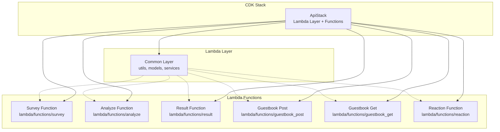
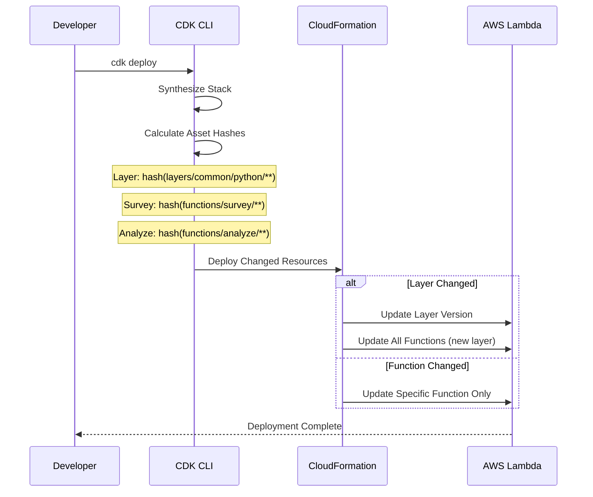

# Design Document: Lambda Layer 리팩토링

## Overview

이 설계는 현재 모든 Lambda 함수가 공유하는 단일 코드 베이스를 Lambda Layer와 개별 함수 디렉토리로 분리하는 리팩토링을 다룹니다.

### 현재 문제점

현재 아키텍처는 모든 Lambda 함수가 `lambda/` 디렉토리 전체를 `commonCode`로 공유합니다:

```typescript
const commonCode = lambda.Code.fromAsset("../lambda", {
  bundling: { /* 전체 디렉토리 번들링 */ }
});
```

이로 인해 다음 문제가 발생합니다:

1. **변경 감지 실패**: 특정 핸들러만 수정해도 CDK가 asset hash를 동일하게 계산하여 배포를 건너뜀
2. **불필요한 재배포**: 공통 코드 수정 시 모든 함수가 재배포됨
3. **느린 배포**: 각 함수가 전체 코드베이스를 번들링하여 배포 시간이 길어짐
4. **큰 배포 패키지**: 각 함수가 사용하지 않는 코드까지 포함하여 패키지 크기가 불필요하게 큼

### 목표 아키텍처

리팩토링 후 구조:

```
lambda/
├── layers/
│   └── common/
│       └── python/          # Lambda Layer 표준 구조
│           ├── utils/
│           ├── models/
│           └── services/
└── functions/
    ├── survey/
    │   ├── handler.py
    │   └── requirements.txt
    ├── analyze/
    │   ├── handler.py
    │   └── requirements.txt
    ├── result/
    │   ├── handler.py
    │   └── requirements.txt
    ├── guestbook_post/
    │   ├── handler.py
    │   └── requirements.txt
    ├── guestbook_get/
    │   ├── handler.py
    │   └── requirements.txt
    └── reaction/
        ├── handler.py
        └── requirements.txt
```

### 핵심 개선사항

1. **정확한 변경 감지**: 각 함수가 독립적인 디렉토리를 가져 개별 asset hash 생성
2. **선택적 배포**: 수정된 함수만 재배포
3. **공통 코드 재사용**: Lambda Layer를 통해 utils, models, services 공유
4. **빠른 배포**: 함수별 작은 패키지 크기와 Layer 캐싱

## Architecture

### 컴포넌트 다이어그램



### 배포 흐름



### Lambda Layer 구조

AWS Lambda Layer는 `/opt` 디렉토리에 마운트됩니다. Python의 경우 `/opt/python`이 자동으로 `sys.path`에 추가됩니다.

```
/opt/
└── python/           # 이 경로가 sys.path에 추가됨
    ├── utils/
    │   ├── __init__.py
    │   ├── logging.py
    │   └── response.py
    ├── models/
    │   ├── __init__.py
    │   └── schemas.py
    └── services/
        ├── __init__.py
        └── validation.py
```

함수 코드에서는 다음과 같이 import:

```python
from utils.logging import get_logger
from models.schemas import SurveyRequest
from services.validation import validate_survey
```

## Components and Interfaces

### 1. Lambda Layer (Common Code)

**책임**: 모든 Lambda 함수에서 공유하는 유틸리티, 모델, 서비스 제공

**위치**: `lambda/layers/common/python/`

**포함 모듈**:

- `utils/`: 로깅, HTTP 응답 유틸리티
- `models/`: Pydantic 데이터 모델
- `services/`: 비즈니스 로직 (validation 등)

**CDK 정의**:

```typescript
const commonLayer = new lambda.LayerVersion(this, "CommonLayer", {
  code: lambda.Code.fromAsset("../lambda/layers/common"),
  compatibleRuntimes: [lambda.Runtime.PYTHON_3_12],
  description: "공통 유틸리티, 모델, 서비스",
});
```

**인터페이스**:

```python
# utils/logging.py
def get_logger(name: str) -> logging.Logger

# utils/response.py
def response(status_code: int, body: dict) -> dict

# models/schemas.py
class SurveyRequest(BaseModel)
class AnalysisResult(BaseModel)
class GuestbookEntry(BaseModel)
# ... 기타 모델

# services/validation.py
def validate_survey(data: dict) -> SurveyRequest
class SurveyValidationError(Exception)
```

### 2. Lambda Functions (개별 핸들러)

각 함수는 독립적인 디렉토리를 가지며, Layer의 공통 코드를 import합니다.

#### Survey Function

**위치**: `lambda/functions/survey/handler.py`

**책임**: 설문 데이터 검증, DynamoDB 저장, Analyze 함수 비동기 호출

**의존성**:
- Layer: `utils.logging`, `utils.response`, `models.schemas`, `services.validation`
- AWS SDK: `boto3` (DynamoDB, Lambda)

**핸들러 시그니처**:

```python
def handler(event: dict, context) -> dict:
    """POST /survey 요청 처리"""
```

**환경 변수**:
- `SURVEY_TABLE_NAME`: DynamoDB 테이블 이름
- `ANALYZE_FUNCTION_NAME`: Analyze Lambda 함수 이름

#### Analyze Function

**위치**: `lambda/functions/analyze/handler.py`

**책임**: Bedrock Agent 호출, 분석 결과 파싱, DynamoDB 저장

**의존성**:
- Layer: `utils.logging`, `utils.response`, `models.schemas`
- AWS SDK: `boto3` (DynamoDB, Bedrock Agent Runtime)

**핸들러 시그니처**:

```python
def handler(event: dict, context) -> dict:
    """비동기 분석 요청 처리"""
```

**환경 변수**:
- `SURVEY_TABLE_NAME`
- `SKILL_GRAPH_TABLE_NAME`
- `CAREER_CARDS_TABLE_NAME`
- `BEDROCK_AGENT_ID`
- `BEDROCK_AGENT_ALIAS_ID`

#### Result Function

**위치**: `lambda/functions/result/handler.py`

**책임**: 세션별 분석 결과 조회

**의존성**:
- Layer: `utils.logging`, `utils.response`, `models.schemas`
- AWS SDK: `boto3` (DynamoDB)

**핸들러 시그니처**:

```python
def handler(event: dict, context) -> dict:
    """GET /result/{sid} 요청 처리"""
```

**환경 변수**:
- `SURVEY_TABLE_NAME`
- `SKILL_GRAPH_TABLE_NAME`
- `CAREER_CARDS_TABLE_NAME`

#### Guestbook Post Function

**위치**: `lambda/functions/guestbook_post/handler.py`

**책임**: 방명록 항목 등록

**의존성**:
- Layer: `utils.logging`, `utils.response`, `models.schemas`, `services.validation`
- AWS SDK: `boto3` (DynamoDB)

**핸들러 시그니처**:

```python
def handler(event: dict, context) -> dict:
    """POST /guestbook 요청 처리"""
```

**환경 변수**:
- `GUESTBOOK_TABLE_NAME`

#### Guestbook Get Function

**위치**: `lambda/functions/guestbook_get/handler.py`

**책임**: 방명록 목록 조회 (페이지네이션)

**의존성**:
- Layer: `utils.logging`, `utils.response`, `models.schemas`
- AWS SDK: `boto3` (DynamoDB)

**핸들러 시그니처**:

```python
def handler(event: dict, context) -> dict:
    """GET /guestbook 요청 처리"""
```

**환경 변수**:
- `GUESTBOOK_TABLE_NAME`

#### Reaction Function

**위치**: `lambda/functions/reaction/handler.py`

**책임**: 방명록 항목에 이모지 반응 추가

**의존성**:
- Layer: `utils.logging`, `utils.response`, `models.schemas`
- AWS SDK: `boto3` (DynamoDB)

**핸들러 시그니처**:

```python
def handler(event: dict, context) -> dict:
    """POST /guestbook/{id}/reaction 요청 처리"""
```

**환경 변수**:
- `GUESTBOOK_TABLE_NAME`

### 3. CDK Stack 수정

**파일**: `infra/lib/api-stack.ts`

**주요 변경사항**:

1. **Lambda Layer 정의**:

```typescript
const commonLayer = new lambda.LayerVersion(this, "CommonLayer", {
  code: lambda.Code.fromAsset("../lambda/layers/common"),
  compatibleRuntimes: [lambda.Runtime.PYTHON_3_12],
  description: "공통 유틸리티, 모델, 서비스",
  removalPolicy: cdk.RemovalPolicy.RETAIN, // 프로덕션에서는 RETAIN
});
```

2. **함수별 독립 코드 경로**:

```typescript
const surveyHandler = new lambda.Function(this, "SurveyHandler", {
  runtime: lambda.Runtime.PYTHON_3_12,
  code: lambda.Code.fromAsset("../lambda/functions/survey"),
  handler: "handler.handler", // 파일명.함수명
  layers: [commonLayer],
  // ... 기타 설정
});
```

3. **Layer 버전 관리**:

Layer는 immutable하므로 내용이 변경되면 새 버전이 생성됩니다. CDK는 자동으로 함수들을 새 Layer 버전으로 업데이트합니다.

## Data Models

기존 데이터 모델은 변경 없이 Layer로 이동합니다.

### Layer 내 모델 위치

**파일**: `lambda/layers/common/python/models/schemas.py`

모든 Pydantic 모델이 이 파일에 정의되어 있으며, 함수들은 Layer를 통해 import합니다:

```python
from models.schemas import (
    SurveyRequest,
    AnalysisResult,
    SkillRisk,
    RoadmapStep,
    CareerCard,
    GuestbookEntry,
    GuestbookRequest,
    ReactionRequest,
)
```

### 마이그레이션 매핑

| 현재 위치 | 새 위치 |
|----------|---------|
| `lambda/models/schemas.py` | `lambda/layers/common/python/models/schemas.py` |
| `lambda/utils/logging.py` | `lambda/layers/common/python/utils/logging.py` |
| `lambda/utils/response.py` | `lambda/layers/common/python/utils/response.py` |
| `lambda/services/validation.py` | `lambda/layers/common/python/services/validation.py` |
| `lambda/handlers/survey_handler.py` | `lambda/functions/survey/handler.py` |
| `lambda/handlers/analyze_handler.py` | `lambda/functions/analyze/handler.py` |
| `lambda/handlers/result_handler.py` | `lambda/functions/result/handler.py` |
| `lambda/handlers/guestbook_post_handler.py` | `lambda/functions/guestbook_post/handler.py` |
| `lambda/handlers/guestbook_get_handler.py` | `lambda/functions/guestbook_get/handler.py` |
| `lambda/handlers/reaction_handler.py` | `lambda/functions/reaction/handler.py` |

### Import 문 변경

**변경 전** (handlers에서):

```python
from models.schemas import SurveyRequest
from services.validation import validate_survey
from utils.logging import get_logger
from utils.response import response
```

**변경 후** (functions에서, Layer 사용):

```python
# 동일한 import 문 유지
# Layer가 /opt/python에 마운트되어 sys.path에 자동 추가됨
from models.schemas import SurveyRequest
from services.validation import validate_survey
from utils.logging import get_logger
from utils.response import response
```

Import 문은 변경되지 않습니다. Layer의 `python/` 디렉토리가 자동으로 Python path에 추가되기 때문입니다.


## Correctness Properties

*A property is a characteristic or behavior that should hold true across all valid executions of a system-essentially, a formal statement about what the system should do. Properties serve as the bridge between human-readable specifications and machine-verifiable correctness guarantees.*

이 리팩토링은 주로 코드 구조 변경이며, 새로운 비즈니스 로직을 추가하지 않습니다. 따라서 correctness는 다음과 같이 검증됩니다:

### Property 1: 기능 동등성 (Behavioral Equivalence)

*For any* Lambda 함수와 입력 이벤트에 대해, 리팩토링 전후의 함수 출력과 부작용(DynamoDB 쓰기, Lambda 호출 등)이 동일해야 합니다.

**Validates: Requirements 5.3, 5.4, 5.5, 6.5**

**검증 방법**: 기존 테스트 스위트를 새 구조에서 실행하여 모든 테스트가 통과하는지 확인합니다.

### Property 2: 모듈 인터페이스 보존 (Interface Preservation)

*For any* Layer 모듈(utils, models, services)의 공개 함수와 클래스에 대해, 함수 시그니처와 반환 타입이 리팩토링 전후에 동일해야 합니다.

**Validates: Requirements 6.5**

**검증 방법**: 
1. 타입 체커(mypy)를 사용하여 타입 호환성 확인
2. 기존 import 문이 수정 없이 동작하는지 확인
3. 기존 테스트가 통과하는지 확인

### Property 3: 변경 감지 독립성 (Change Detection Independence)

*For any* 단일 Lambda 함수의 코드 변경에 대해, CDK는 해당 함수의 asset hash만 변경하고 다른 함수의 hash는 변경하지 않아야 합니다.

**Validates: Requirements 4.1, 4.3, 4.4, 4.5**

**검증 방법**:
1. 각 함수의 handler.py를 개별적으로 수정
2. `cdk synth` 실행 후 asset hash 비교
3. 수정된 함수의 hash만 변경되었는지 확인

### Property 4: Layer 변경 전파 (Layer Change Propagation)

*For any* Layer 공통 코드의 변경에 대해, CDK는 Layer의 asset hash를 변경하고 모든 함수가 새 Layer 버전을 참조하도록 업데이트해야 합니다.

**Validates: Requirements 1.5, 4.2**

**검증 방법**:
1. Layer 내 파일(예: utils/logging.py) 수정
2. `cdk synth` 실행 후 CloudFormation 템플릿 확인
3. Layer 버전이 변경되고 모든 함수가 새 버전을 참조하는지 확인

## Error Handling

### 마이그레이션 중 에러 처리

1. **파일 이동 실패**
   - 원본 파일이 존재하지 않는 경우: 명확한 에러 메시지와 함께 중단
   - 대상 디렉토리 생성 실패: 권한 에러 메시지와 함께 중단
   - 원본 파일은 마이그레이션 검증 완료 전까지 보존

2. **Import 경로 에러**
   - Layer 모듈을 찾을 수 없는 경우: Python ImportError 발생
   - 로컬 테스트 시 PYTHONPATH 설정 필요: `export PYTHONPATH="${PYTHONPATH}:lambda/layers/common/python"`
   - 배포 후에는 Layer가 자동으로 `/opt/python`에 마운트되어 해결됨

3. **CDK Synthesis 에러**
   - Layer 경로가 잘못된 경우: CDK가 "Cannot find asset" 에러 발생
   - 함수 경로가 잘못된 경우: CDK가 "Cannot find asset" 에러 발생
   - handler 경로가 잘못된 경우: 배포 후 Lambda가 "Handler not found" 에러 발생

4. **배포 실패**
   - Layer 배포 실패: CloudFormation이 롤백하여 이전 상태 유지
   - 함수 배포 실패: CloudFormation이 롤백하여 이전 상태 유지
   - 부분 배포 실패: CloudFormation이 자동으로 롤백

### 런타임 에러 처리

리팩토링은 런타임 동작을 변경하지 않으므로, 기존 에러 처리 로직이 그대로 유지됩니다:

1. **Lambda 함수 에러**
   - 각 핸들러는 try-except로 예외를 캐치하고 적절한 HTTP 상태 코드 반환
   - 예상치 못한 에러는 500 Internal Server Error로 반환
   - 모든 에러는 CloudWatch Logs에 기록

2. **Layer Import 에러**
   - Layer 모듈을 import할 수 없는 경우: Lambda 초기화 단계에서 실패
   - CloudWatch Logs에 ImportError 기록
   - API Gateway는 502 Bad Gateway 반환

3. **의존성 에러**
   - Layer에 필요한 패키지가 없는 경우: ImportError 발생
   - 함수별 requirements.txt에 필요한 패키지가 없는 경우: ImportError 발생
   - 해결: requirements.txt 업데이트 후 재배포

### 롤백 전략

1. **CloudFormation 자동 롤백**
   - 배포 중 에러 발생 시 CloudFormation이 자동으로 이전 상태로 롤백
   - 롤백 시간: 일반적으로 2-3분 소요

2. **수동 롤백**
   - `cdk deploy --rollback` 명령으로 이전 스택 버전으로 롤백
   - 또는 AWS Console에서 CloudFormation 스택 롤백

3. **코드 롤백**
   - Git을 사용하여 이전 커밋으로 되돌리기
   - `cdk deploy`로 이전 코드 재배포

## Testing Strategy

### 테스트 접근 방식

이 리팩토링은 구조 변경이므로, 테스트 전략은 다음과 같이 구성됩니다:

1. **구조 검증 테스트**: 파일 시스템 구조가 올바른지 확인
2. **기존 기능 테스트**: 리팩토링 전 작성된 테스트를 새 구조에서 실행
3. **통합 테스트**: CDK synthesis와 배포가 정상 동작하는지 확인
4. **변경 감지 테스트**: CDK가 변경을 올바르게 감지하는지 확인

### 1. 구조 검증 테스트 (Unit Tests)

**목적**: 파일 시스템 구조가 요구사항을 만족하는지 확인

**테스트 파일**: `lambda/tests/test_structure.py`

**테스트 케이스**:

```python
def test_layer_structure_exists():
    """Layer 디렉토리 구조가 올바른지 확인"""
    assert Path("lambda/layers/common/python").exists()
    assert Path("lambda/layers/common/python/utils").exists()
    assert Path("lambda/layers/common/python/models").exists()
    assert Path("lambda/layers/common/python/services").exists()

def test_function_directories_exist():
    """모든 함수 디렉토리가 존재하는지 확인"""
    functions = ["survey", "analyze", "result", "guestbook_post", "guestbook_get", "reaction"]
    for func in functions:
        assert Path(f"lambda/functions/{func}").exists()
        assert Path(f"lambda/functions/{func}/handler.py").exists()
        assert Path(f"lambda/functions/{func}/requirements.txt").exists()

def test_layer_modules_exist():
    """Layer 모듈 파일이 존재하는지 확인"""
    assert Path("lambda/layers/common/python/utils/logging.py").exists()
    assert Path("lambda/layers/common/python/utils/response.py").exists()
    assert Path("lambda/layers/common/python/models/schemas.py").exists()
    assert Path("lambda/layers/common/python/services/validation.py").exists()
```

**실행**: `pytest lambda/tests/test_structure.py`

### 2. 기존 기능 테스트 (Unit Tests)

**목적**: 리팩토링 후에도 기존 기능이 정상 동작하는지 확인

**테스트 파일**: 
- `lambda/tests/test_guestbook_handlers.py`
- `lambda/tests/test_result_handler.py`
- 기타 기존 테스트 파일

**설정**: `pytest.ini` 또는 `conftest.py`에서 PYTHONPATH 설정

```python
# conftest.py
import sys
from pathlib import Path

# Layer 모듈을 Python path에 추가
layer_path = Path(__file__).parent.parent / "layers" / "common" / "python"
sys.path.insert(0, str(layer_path))
```

**실행**: `pytest lambda/tests/`

**성공 기준**: 모든 기존 테스트가 수정 없이 통과해야 함

### 3. CDK 통합 테스트 (Integration Tests)

**목적**: CDK 스택이 올바르게 synthesis되고 배포되는지 확인

**테스트 파일**: `infra/test/api-stack.test.ts`

**테스트 케이스**:

```typescript
test('Lambda Layer is created', () => {
  const app = new cdk.App();
  const stack = new ApiStack(app, 'TestStack', { /* props */ });
  const template = Template.fromStack(stack);
  
  template.hasResourceProperties('AWS::Lambda::LayerVersion', {
    CompatibleRuntimes: ['python3.12'],
    Description: Match.stringLikeRegexp('공통'),
  });
});

test('All functions have Layer attached', () => {
  const app = new cdk.App();
  const stack = new ApiStack(app, 'TestStack', { /* props */ });
  const template = Template.fromStack(stack);
  
  const functions = template.findResources('AWS::Lambda::Function');
  Object.values(functions).forEach((func: any) => {
    expect(func.Properties.Layers).toBeDefined();
    expect(func.Properties.Layers.length).toBeGreaterThan(0);
  });
});

test('Functions use individual code paths', () => {
  const app = new cdk.App();
  const stack = new ApiStack(app, 'TestStack', { /* props */ });
  const template = Template.fromStack(stack);
  
  // Asset metadata에서 각 함수가 다른 경로를 사용하는지 확인
  const metadata = template.toJSON().Metadata;
  const assetPaths = Object.values(metadata)
    .filter((m: any) => m.Type === 'aws:cdk:asset')
    .map((m: any) => m.Data.path);
  
  // 중복 제거 후 개수가 함수 개수 + Layer와 같은지 확인
  const uniquePaths = new Set(assetPaths);
  expect(uniquePaths.size).toBeGreaterThanOrEqual(7); // 6 functions + 1 layer
});
```

**실행**: `npm test` (infra 디렉토리에서)

### 4. 변경 감지 테스트 (Manual/Scripted)

**목적**: CDK가 변경을 올바르게 감지하는지 확인

**테스트 스크립트**: `infra/scripts/test-change-detection.sh`

```bash
#!/bin/bash
set -e

echo "=== 변경 감지 테스트 ==="

# 1. 초기 synth
echo "1. 초기 synthesis..."
cdk synth > /tmp/synth1.json

# 2. 특정 함수 수정
echo "2. survey 함수 수정..."
echo "# test comment" >> ../lambda/functions/survey/handler.py
cdk synth > /tmp/synth2.json

# 3. 변경 확인
echo "3. 변경 감지 확인..."
if diff /tmp/synth1.json /tmp/synth2.json | grep -q "SurveyHandler"; then
    echo "✓ Survey 함수 변경 감지됨"
else
    echo "✗ Survey 함수 변경 감지 실패"
    exit 1
fi

# 4. 원복
git checkout ../lambda/functions/survey/handler.py

# 5. Layer 수정
echo "4. Layer 수정..."
echo "# test comment" >> ../lambda/layers/common/python/utils/logging.py
cdk synth > /tmp/synth3.json

# 6. Layer 변경 확인
if diff /tmp/synth1.json /tmp/synth3.json | grep -q "CommonLayer"; then
    echo "✓ Layer 변경 감지됨"
else
    echo "✗ Layer 변경 감지 실패"
    exit 1
fi

# 7. 원복
git checkout ../lambda/layers/common/python/utils/logging.py

echo "=== 모든 변경 감지 테스트 통과 ==="
```

**실행**: `bash infra/scripts/test-change-detection.sh`

### 5. 배포 검증 테스트 (E2E)

**목적**: 실제 배포 후 함수가 정상 동작하는지 확인

**테스트 방법**:

1. **배포 전 체크리스트**:
   ```bash
   # 구조 테스트
   pytest lambda/tests/test_structure.py
   
   # 기능 테스트
   pytest lambda/tests/
   
   # CDK 테스트
   cd infra && npm test
   
   # CDK diff 확인
   cdk diff
   ```

2. **배포**:
   ```bash
   cd infra
   cdk deploy CareerDoomsdayApiStack
   ```

3. **배포 후 검증**:
   ```bash
   # API 엔드포인트 테스트
   curl -X POST https://[api-url]/prod/survey -d '{"session_id":"test",...}'
   
   # CloudWatch Logs 확인
   aws logs tail /aws/lambda/CareerDoomsdayApiStack-SurveyHandler --follow
   ```

4. **롤백 테스트** (선택적):
   ```bash
   # 이전 버전으로 롤백
   aws cloudformation rollback-stack --stack-name CareerDoomsdayApiStack
   
   # 또는 Git으로 이전 코드 복원 후 재배포
   git revert HEAD
   cdk deploy
   ```

### 테스트 실행 순서

마이그레이션 시 다음 순서로 테스트를 실행합니다:

1. **구조 검증**: `pytest lambda/tests/test_structure.py`
2. **기능 테스트**: `pytest lambda/tests/`
3. **CDK 테스트**: `cd infra && npm test`
4. **변경 감지**: `bash infra/scripts/test-change-detection.sh`
5. **CDK Diff**: `cd infra && cdk diff`
6. **배포**: `cd infra && cdk deploy`
7. **E2E 검증**: API 엔드포인트 테스트

### 테스트 커버리지 목표

- **구조 테스트**: 100% (모든 필수 파일과 디렉토리 확인)
- **기능 테스트**: 기존 커버리지 유지 (현재 수준 그대로)
- **CDK 테스트**: Layer와 함수 정의 100% 확인
- **변경 감지**: 각 함수와 Layer에 대해 개별 테스트

### Property-Based Testing

이 리팩토링은 구조 변경이므로 전통적인 property-based testing이 적용되지 않습니다. 대신 다음과 같은 "속성"을 검증합니다:

1. **구조적 속성**: 모든 필수 파일과 디렉토리가 존재
2. **동작적 속성**: 기존 테스트가 모두 통과 (기능 동등성)
3. **배포 속성**: CDK가 변경을 올바르게 감지하고 배포

이러한 속성들은 위의 unit test와 integration test로 검증됩니다.

