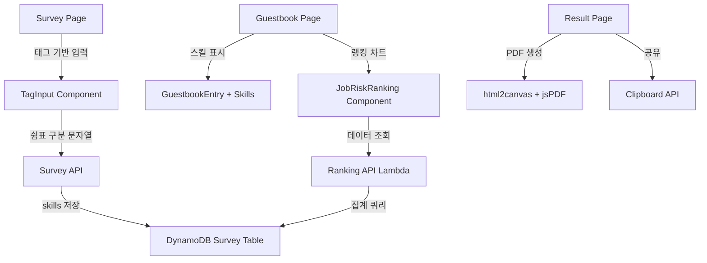

# Design Document: UX Enhancements

## Overview

Career Doomsday Clock 애플리케이션에 5가지 UX 개선 기능을 추가한다:
1. 태그 기반 스킬 입력 컴포넌트
2. 방명록에 스킬 태그 표시
3. 직업별 수명 랭킹 차트 (Global Job Risk Ranking)
4. 결과 PDF 다운로드
5. 결과 공유하기 (클립보드 복사)

## Architecture

기존 Next.js + Lambda + DynamoDB 아키텍처를 유지하면서 프론트엔드 컴포넌트와 백엔드 API를 확장한다.



## Components and Interfaces

### 1. TagInput Component (`frontend/src/components/ui/TagInput.tsx`)

재사용 가능한 태그 입력 컴포넌트.

```typescript
interface TagInputProps {
  tags: string[];
  onChange: (tags: string[]) => void;
  placeholder?: string;
  disabled?: boolean;
  error?: string;
  maxTags?: number;
}
```

동작:
- Enter 또는 쉼표(,) 입력 시 태그 추가
- 태그 옆 X 버튼 클릭 시 삭제
- 빈 입력 상태에서 Backspace 시 마지막 태그 삭제
- 중복 태그 방지 (대소문자 무시 비교)
- 공백만으로 구성된 태그 방지

### 2. JobRiskRanking Component (`frontend/src/components/features/JobRiskRanking.tsx`)

직업별 D-Day 평균을 수평 바 차트로 시각화.

```typescript
interface JobRiskData {
  job_title: string;
  avg_dday: number;
  count: number;
}

interface JobRiskRankingProps {
  data: JobRiskData[];
  loading: boolean;
}
```

- CSS 기반 수평 바 차트 (외부 차트 라이브러리 미사용)
- D-Day 오름차순 정렬 (위험도 높은 직업이 상단)
- 디스토피아 테마 적용 (네온 레드/시안 색상)
- 최대 15개 직업 표시

### 3. Ranking API Lambda (`lambda/functions/ranking/handler.py`)

DynamoDB survey 테이블에서 직업별 D-Day 통계를 집계.

```python
# GET /ranking
# Response:
{
  "items": [
    {"job_title": "개발자", "avg_dday": 5.2, "count": 12},
    {"job_title": "디자이너", "avg_dday": 7.8, "count": 5}
  ]
}
```

- survey 테이블을 스캔하여 status=completed인 항목만 집계
- job_title별 평균 dday 계산
- count < 2인 직업은 제외
- avg_dday 오름차순 정렬

### 4. PDF 다운로드 (`frontend/src/lib/pdf.ts`)

html2canvas + jsPDF를 사용하여 결과 페이지를 PDF로 변환.

- 결과 영역을 캡처하여 이미지로 변환 후 PDF에 삽입
- 디스토피아 테마 배경색 유지
- 파일명: `career-doomsday-{timestamp}.pdf`

### 5. 공유하기 기능

결과 요약 텍스트를 클립보드에 복사.

```
🔥 커리어 종말 시계 결과
직업: {job_title}
D-Day: {dday}년
{dday_reason}

스킬 위험도:
- {skill_name}: {replacement_prob}%
...

Career Doomsday Clock에서 확인하세요!
```

### 6. 방명록 스킬 표시

방명록 등록 시 skills 데이터를 함께 저장하고, 조회 시 태그 형태로 표시.

- POST /guestbook 요청에 skills 필드 추가
- 방명록 항목에 스킬 태그 배지 렌더링

## Data Models

### Guestbook Entry (확장)

기존 방명록 항목에 `skills` 필드 추가:

```typescript
interface GuestbookEntry {
  entry_id: string;
  created_at: string;
  job_title: string;
  dday: number;
  message: string;
  skills?: string;  // 쉼표 구분 스킬 문자열 (신규)
  reactions: Record<string, number>;
}
```

### Ranking Response

```typescript
interface RankingResponse {
  items: JobRiskData[];
}
```


## Correctness Properties

*A property is a characteristic or behavior that should hold true across all valid executions of a system-essentially, a formal statement about what the system should do. Properties serve as the bridge between human-readable specifications and machine-verifiable correctness guarantees.*

### Property 1: Adding a valid tag grows the tag list

*For any* tag list and any valid (non-empty, non-duplicate) skill string, adding it to the tag list should result in the tag list length growing by one and the new tag being present in the list.
**Validates: Requirements 1.1**

### Property 2: Removing a tag shrinks the tag list

*For any* non-empty tag list and any tag in that list, removing it should result in the tag list length decreasing by one and the removed tag no longer being present.
**Validates: Requirements 1.2**

### Property 3: Backspace removes the last tag

*For any* non-empty tag list, pressing backspace on an empty input should result in the last tag being removed and the remaining tags being unchanged.
**Validates: Requirements 1.3**

### Property 4: Invalid tags are rejected

*For any* tag list and any invalid input (duplicate tag or whitespace-only string), attempting to add it should leave the tag list unchanged.
**Validates: Requirements 1.4, 1.5**

### Property 5: Tag list serialization round-trip

*For any* array of valid skill strings, joining them with commas should produce a string that, when split by commas and trimmed, yields the original array.
**Validates: Requirements 1.6**

### Property 6: Ranking aggregation correctness

*For any* set of completed survey records, the ranking aggregation should correctly compute the average D-Day per job title, exclude jobs with fewer than 2 submissions, and include the correct submission count.
**Validates: Requirements 3.1, 3.3**

### Property 7: Ranking sort order

*For any* ranking data set, the items should be sorted by average D-Day in ascending order (most at-risk jobs first).
**Validates: Requirements 3.2**

### Property 8: Share text contains all required fields

*For any* valid result data (with D-Day, skill risks, and career cards), the generated share text should contain the job title, D-Day value, and D-Day reason.
**Validates: Requirements 5.1**

## Error Handling

- TagInput: 중복/공백 태그 추가 시 시각적 피드백 없이 조용히 무시
- Ranking API: DynamoDB 스캔 실패 시 500 에러 반환, 프론트엔드에서 랭킹 섹션 숨김
- PDF 생성: html2canvas 실패 시 에러 메시지 표시, 버튼 상태 복원
- 공유: Clipboard API 미지원 시 텍스트를 직접 표시하는 fallback UI

## Testing Strategy

### 단위 테스트
- Jest + React Testing Library로 TagInput 컴포넌트 테스트
- 랭킹 집계 로직 단위 테스트 (Python pytest)
- 공유 텍스트 생성 함수 단위 테스트

### 속성 기반 테스트
- fast-check 라이브러리를 사용하여 프론트엔드 속성 테스트 (최소 100회 반복)
- hypothesis 라이브러리를 사용하여 백엔드 속성 테스트 (최소 100회 반복)
- 각 속성 테스트는 설계 문서의 correctness property를 명시적으로 참조
- 형식: `**Feature: ux-enhancements, Property {number}: {property_text}**`
